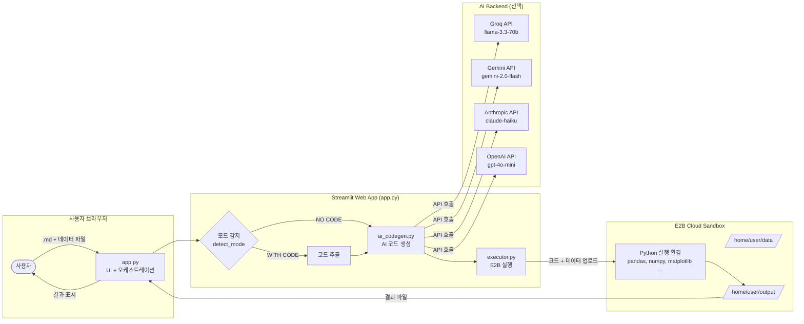

# Configuration Guide / 설정 가이드

---

## Architecture / 아키텍처



---

## File Structure / 파일 구조

```
apps/ai-code-execution/
├── app.py              # Streamlit UI + 메인 오케스트레이션
├── ai_codegen.py       # AI 백엔드 (Groq/Gemini/Claude/OpenAI 스위처블)
├── executor.py         # E2B 샌드박스 실행기
├── config.py           # 설정값 (AI_BACKEND, MAX_RETRIES 등)
├── requirements.txt    # Python 의존성
├── .env                # API 키 (커밋 금지)
├── .env.example        # API 키 템플릿
├── .gitignore
├── README.ko.md        # 한글 사용 설명서
├── CONFIGURE.md        # 설정 가이드 (이 파일)
└── test_basic.py       # 로컬 스모크 테스트
```

---

## Environment Variables / 환경변수

`.env.example`을 복사해서 `.env`로 저장 후 값을 입력합니다.

```bash
cp .env.example .env
```

| 변수명 | 필수 | 설명 |
|--------|------|------|
| `E2B_API_KEY` | **필수** | E2B 샌드박스 API 키 |
| `AI_BACKEND` | 선택 | 기본값: `groq` |
| `GROQ_API_KEY` | AI_BACKEND=groq 시 필수 | Groq API 키 (무료) |
| `GEMINI_API_KEY` | AI_BACKEND=gemini 시 필수 | Google Gemini API 키 |
| `ANTHROPIC_API_KEY` | AI_BACKEND=claude 시 필수 | Anthropic API 키 |
| `OPENAI_API_KEY` | AI_BACKEND=openai 시 필수 | OpenAI API 키 |

### API 키 발급

| 서비스 | 무료 티어 | 발급 URL |
|--------|----------|---------|
| E2B | 100시간/월 | https://e2b.dev/dashboard |
| Groq | 분당 요청 제한 있음 (무료) | https://console.groq.com |
| Gemini | 무료 티어 있음 | https://aistudio.google.com/app/apikey |
| Anthropic | 유료 | https://console.anthropic.com |
| OpenAI | 유료 | https://platform.openai.com/api-keys |

---

## config.py 설정값

```python
AI_BACKEND = "groq"       # 사용할 AI 백엔드
MAX_RETRIES = 3           # 실행 실패 시 최대 재시도 횟수
MAX_MD_TOKENS = 100000    # .md 파일 토큰 경고 기준
SANDBOX_TIMEOUT = 120     # E2B 샌드박스 타임아웃 (초)
DATA_DIR = "/home/user/data/"    # 샌드박스 입력 파일 경로
OUTPUT_DIR = "/home/user/output/"  # 샌드박스 출력 파일 경로
```

---

## Streamlit Cloud 배포

1. GitHub repo에 push
2. [share.streamlit.io](https://share.streamlit.io) → **New app**
3. 설정:
   - Repository: `jahyunlee00299/claude-scientific-skills`
   - Branch: `feat/team-orchestrator-v2`
   - Main file path: `apps/ai-code-execution/app.py`
4. **Advanced settings → Secrets**에 아래 입력:

```toml
E2B_API_KEY = "your_e2b_key"
GROQ_API_KEY = "your_groq_key"
AI_BACKEND = "groq"
```

5. **Deploy** 클릭

---

## AI Backend 전환 방법

`.env` 파일에서 `AI_BACKEND` 값만 변경하면 됩니다:

```bash
# Groq (기본값, 무료)
AI_BACKEND=groq
GROQ_API_KEY=gsk_...

# Gemini (무료 티어)
AI_BACKEND=gemini
GEMINI_API_KEY=AIza...

# Claude
AI_BACKEND=claude
ANTHROPIC_API_KEY=sk-ant-...

# OpenAI
AI_BACKEND=openai
OPENAI_API_KEY=sk-...
```

---

## 로컬 테스트

```bash
cd apps/ai-code-execution
python test_basic.py
```

정상 출력:
```
[TEST 1] E2B Executor — hello world
[OK] stdout: 'Hello from E2B!\n3\n'

[TEST 2] AI Codegen — 간단한 지시
[OK] Generated code: ...

[TEST 3] Full pipeline
[OK] stdout: 'The sum of numbers 1 to 10 is: 55\n'
```
