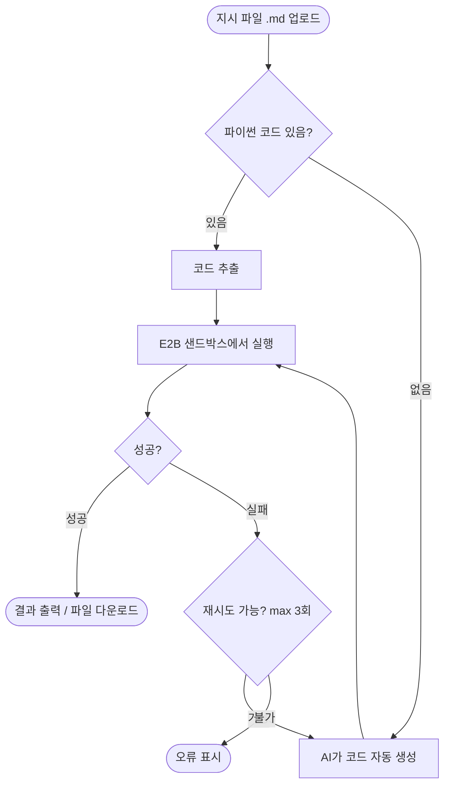

# AI 코드 실행기 (AI-Powered Code Execution)

코딩 없이 AI가 파이썬 코드를 생성하고, 클라우드 샌드박스에서 자동 실행해드립니다.

---

## 어떻게 동작하나요?



---

## 빠른 시작

### 1. 지시 파일 작성

`NO CODE 모드` — 하고 싶은 것을 자연어로 설명

```markdown
# Task: 월별 매출 분석

## Goal
sales_2024.xlsx 파일의 월별 총 매출을 계산하고,
막대그래프로 시각화해주세요.

## Input Data
| File Name | Format | Description |
|-----------|--------|-------------|
| sales_2024.xlsx | Excel | 월별 매출 데이터 (Date, Product, Amount 컬럼) |

## Output
- 텍스트: 월별 매출 합계 출력
- 이미지: monthly_sales.png (막대그래프)
```

`WITH CODE 모드` — 코드를 직접 넣으면 AI가 수정·완성 후 실행

````markdown
# Task: 데이터 정제

## What Needs to Be Done
중복 행 제거 후 cleaned_data.csv로 저장

```python
import pandas as pd
df = pd.read_csv("/home/user/data/raw_data.csv")
# TODO: 중복 제거
df.to_csv("/home/user/output/cleaned_data.csv", index=False)
```
````

### 2. 웹앱에서 실행

1. [앱 URL](https://claude-scientific-skills-7w7pxx6re8wlgwpbmrthdt.streamlit.app/) 접속
2. 지시 파일 `.md` 업로드
3. 데이터 파일 업로드 (선택)
4. **▶ 실행** 클릭
5. 결과 확인 및 파일 다운로드

---

## 지원 파일 형식

| 입력 | 출력 |
|------|------|
| CSV, Excel (.xlsx), JSON | CSV, Excel, PNG/JPG (이미지), 텍스트 |
| 이미지 (PNG, JPG) | — |
| 텍스트 (.txt) | — |

---

## 샌드박스 기본 설치 라이브러리

`pandas` `numpy` `matplotlib` `seaborn` `scipy` `scikit-learn` `openpyxl` `pillow`

- 입력 파일 경로: `/home/user/data/{파일명}`
- 출력 파일 경로: `/home/user/output/{파일명}`

---

## 로컬 설치 (개발자용)

```bash
git clone https://github.com/jahyunlee00299/claude-scientific-skills
cd apps/ai-code-execution

pip install -r requirements.txt

# .env 파일 생성 (아래 configure 참고)
cp .env.example .env
# .env 파일에 API 키 입력

streamlit run app.py
```

→ 자세한 설정은 [CONFIGURE.md](CONFIGURE.md) 참고

---

## 제한사항

- 샌드박스 인터넷 접속 불가 (기본값)
- 최대 파일 업로드 크기: 200MB
- 샌드박스 메모리: 512MB (E2B 무료 티어)
- 세션 독립: 각 실행은 독립적 (이전 실행 결과 유지 안 됨)
