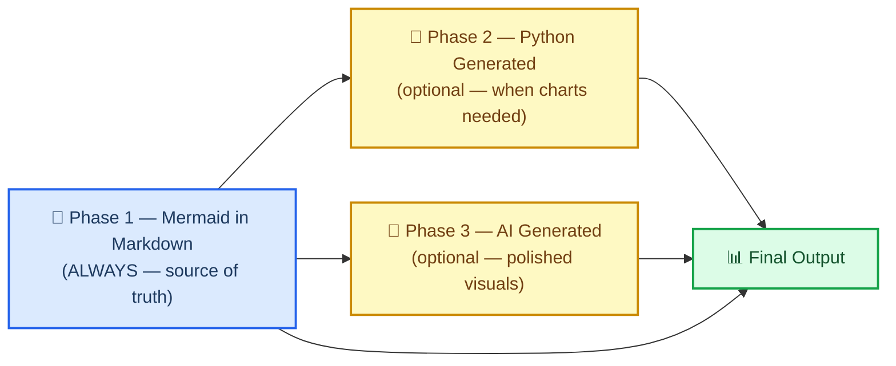

# Issue-00000050: Add Markdown and Mermaid Writing Skill

| Field | Value |
| ---------------------- | ------------------------------------------------------------------------------------------------- |
| **Issue** | `#50` |
| **Type** | ✨ Feature |
| **Severity** | 🟡 Medium |
| **Priority** | P1 |
| **Reporter** | Clayton Young (borealBytes / Superior Byte Works, LLC) |
| **Assignee** | Unassigned |
| **Date reported** | 2026-02-19 |
| **Status** | Open |
| **Users affected** | All scientific skill users producing documentation, reports, or diagrams |
| **Revenue impact** | Indirect — improves skill quality, adoption, and downstream reproducibility |
| **Resolved in** | [PR-00000050](../pr/pr-00000050-markdown-mermaid-skill.md) |
| **Time to resolution** | TBD |

---

## 📋 Summary

Create a new skill — `markdown-mermaid-writing` — that establishes **markdown with embedded Mermaid diagrams as the DEFAULT and canonical format** for scientific documentation output. The core principle: text-based diagrams are the source of truth. Python-generated or AI-generated images are downstream conversions, never the starting point.

### Customer impact

| Dimension | Assessment |
| --------------------- | ------------------------------------------------------------------------- |
| **Who's affected** | Researchers, scientists, data engineers using skills for documentation |
| **How many** | All users producing reports, papers, analysis docs, or any diagrams |
| **Business impact** | Reduces downstream rendering failures; improves reproducibility and AI-readability of outputs |
| **Workaround exists** | Yes — users can continue using existing image generation methods |

---

## 💡 Motivation and origin

### The conversation that sparked this

This feature request emerged from a discussion in the K-Dense Discord on 2026-02-19 about balancing AGENTS.md vs skills and the importance of documentation standards for sharing and combining scientific skills[^1].

> "One note I might offer you all in the claude-scientific-skills that would make it even better is better directions for writing markdown. Specifically using mermaid diagrams extensively and using tables and those instead of python created diagrams when it makes sense. From my experience, the more you get your reports and files in .md in just regular text, which mermaid is as well as being a simple 'script language'. This just helps with any downstream rendering and especially AI generated images (using mermaid instead of just long form text to describe relationships < tokens). Additionally mermaid can render along with markdown for easy use almost anywhere by humans or AI."
>
> — Clayton Young (@borealBytes), K-Dense Discord, 2026-02-19

The K-Dense team responded positively and confirmed this direction aligns with their upcoming reorganization plans[^2].

### Why markdown + Mermaid as source

| Aspect | Mermaid in Markdown | Python / AI Images |
| ----------------------------- | ------------------- | ------------------- |
| **Version control** | ✅ Full git diff | ❌ Binary blob |
| **Token efficiency** | ✅ Less than prose descriptions | ❌ Base64 or external refs |
| **Human editable** | ✅ Any text editor | ❌ Requires regeneration |
| **AI parseable** | ✅ Structured text, no vision model | ❌ Requires vision model |
| **Platform support** | ✅ GitHub, GitLab, Notion, VS Code | ⚠️ Requires image hosting |
| **Downstream flexibility** | ✅ Convert to images anytime | ❌ One-way |
| **Accessibility** | ✅ accTitle / accDescr on every diagram | ❌ Alt-text often missing |

### Three-phase workflow



---

## 🎯 Acceptance criteria

### Must have

- [ ] New skill directory: `scientific-skills/markdown-mermaid-writing/`
- [ ] `SKILL.md` with YAML frontmatter, philosophy section, workflow guide
- [ ] Markdown style guide (`references/markdown_style_guide.md`) — full guide, ~730 lines
- [ ] Mermaid style guide (`references/mermaid_style_guide.md`) — full guide, ~454 lines
- [ ] All 24 diagram type guides (`references/diagrams/*.md`)
- [ ] All 9 document templates (`templates/*.md`)
- [ ] Example research report in `assets/examples/`
- [ ] Issue and PR documents following the AGENTS.md "Everything is Code" convention

### Must not have

- [ ] Modification of any existing skills
- [ ] Breaking changes to repo structure
- [ ] Removal of Python/AI image generation options — those remain valid as downstream phases

### Integration points

- `scientific-schematics` — use after mermaid source to generate AI-polished images
- `scientific-writing` — use this skill for all document structure and diagrams within manuscripts
- `literature-review` — use this skill for formatting findings and relationship diagrams

---

## 🔍 Technical details

### Content sources

All style guides and templates ported from the `SuperiorByteWorks-LLC/agent-project` repository under Apache-2.0 license with attribution retained[^3].

| Source path | Destination |
| ------------------------------------------- | ---------------------------------------------------- |
| `agentic/markdown_style_guide.md` | `references/markdown_style_guide.md` |
| `agentic/mermaid_style_guide.md` | `references/mermaid_style_guide.md` |
| `agentic/mermaid_diagrams/*.md` (24 files) | `references/diagrams/*.md` |
| `agentic/markdown_templates/*.md` (9 files) | `templates/*.md` |

### Skill directory structure

```text
scientific-skills/markdown-mermaid-writing/
├── SKILL.md
├── references/
│   ├── markdown_style_guide.md
│   ├── mermaid_style_guide.md
│   └── diagrams/           ← 24 diagram type guides
│       ├── flowchart.md
│       ├── sequence.md
│       └── [22 more]
├── templates/              ← 9 document templates
│   ├── pull_request.md
│   ├── issue.md
│   └── [7 more]
└── assets/
    └── examples/
        └── example-research-report.md
```

---

## 📝 References

[^1]: K-Dense Discord thread, 2026-02-19. Discussion between Clayton Young (@borealBytes), Orion Li (K-Dense), and Timothy about AGENTS.md standards and scientific documentation.

[^2]: Orion Li (K-Dense), responding: "Thanks for letting us know! We'll make sure to include this into our sauce when we implement our upcoming reorganization of the skills." — K-Dense Discord, 2026-02-19.

[^3]: Boreal Bytes / Superior Byte Works, LLC. `opencode` repository. https://github.com/SuperiorByteWorks-LLC/agent-project. Apache-2.0 License.

---

_Last updated: 2026-02-19_
