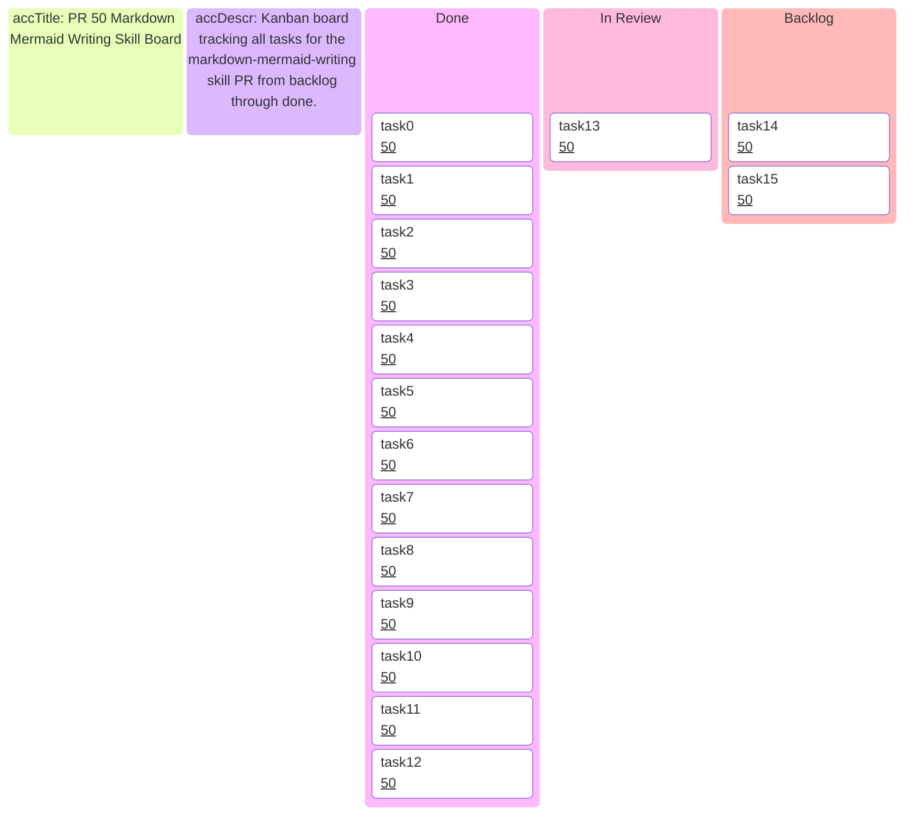
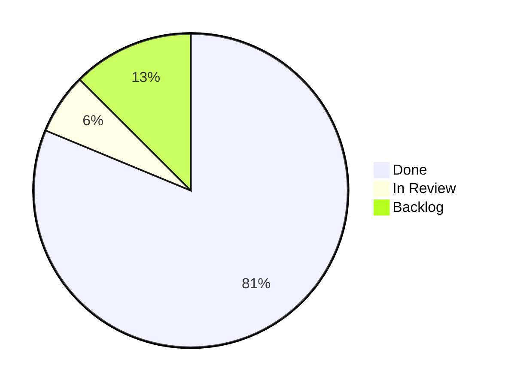

# Kanban: feat-00000050 — Markdown and Mermaid Writing Skill

_Feature board tracking PR #50 — `feat/markdown-mermaid-writing-skill` → `main`_

---

## 📋 Board overview

---

## 🎯 Scope

| Field | Value |
| -------------- | -------------------------------------------------------------------- |
| **PR** | [#50](../pr/pr-00000050-markdown-mermaid-skill.md) |
| **Issue** | [#50](../issues/issue-00000050-markdown-mermaid-skill.md) |
| **Branch** | `feat/markdown-mermaid-writing-skill` |
| **Target repo** | `K-Dense-AI/claude-scientific-skills` |
| **Fork** | `borealBytes/claude-scientific-skills` |
| **Started** | 2026-02-19 |
| **Status** | 🟡 In Review — PR #50 open, awaiting K-Dense team review |

---

## ✅ Completed tasks

| Task | Evidence |
| -------------------------------------------------- | -------------------------------------------------- |
| Issue-00000050 feature request doc | `docs/project/issues/issue-00000050-markdown-mermaid-skill.md` |
| PR-00000050 record doc | `docs/project/pr/pr-00000050-markdown-mermaid-skill.md` |
| Skill directory structure | `scientific-skills/markdown-mermaid-writing/` |
| Markdown style guide (733 lines) | `references/markdown_style_guide.md` |
| Mermaid style guide (458 lines) | `references/mermaid_style_guide.md` |
| 24 diagram type guides | `references/diagrams/*.md` |
| 9 document templates | `templates/*.md` |
| SKILL.md with source format philosophy | `scientific-skills/markdown-mermaid-writing/SKILL.md` |
| Example CRISPR research report | `assets/examples/example-research-report.md` |
| Attribution corrected to SuperiorByteWorks-LLC | All 42 refs updated |
| Mermaid `\n` → ` ` in node labels | 12 occurrences fixed across 4 files |
| Docs renumbered to #50 | Matches upstream next available number |

---

## 🔄 In progress

_Nothing currently in progress._

---

## 📋 Backlog

| Task | Blocked by | Notes |
| ----------------------- | ---------- | --------------------------------------------- |
| Human review / approval | PR push | K-Dense team reviews and merges |
| Merge to main | Approval | Standard merge process |

---

## 📊 Progress

---

## 🔗 References

- [PR-00000050](../pr/pr-00000050-markdown-mermaid-skill.md)
- [Issue-00000050](../issues/issue-00000050-markdown-mermaid-skill.md)
- [Upstream PR](https://github.com/K-Dense-AI/claude-scientific-skills/pull/50) (once pushed)
- [Skill source](https://github.com/SuperiorByteWorks-LLC/agent-project)

---

_Last updated: 2026-02-19_
