# PR-00000050: feat(scientific-communication): add markdown-mermaid-writing skill

| Field | Value |
| ------------------- | ----------------------------------------------------------------------------------------------------------------------------- |
| **PR** | `#50` (https://github.com/K-Dense-AI/claude-scientific-skills/pull/50) |
| **Author** | Clayton Young (Boreal Bytes / Superior Byte Works, LLC) — [LinkedIn](https://www.linkedin.com/in/claytoneyoung/) · [Clayton@SuperiorByteWorks.com](mailto:Clayton@SuperiorByteWorks.com) |
| **Date** | 2026-02-19 |
| **Status** | Open — Draft |
| **Branch** | `feat/markdown-mermaid-writing-skill` → `main` |
| **Related issues** | [#50](../issues/issue-00000050-markdown-mermaid-skill.md) |
| **Kanban board** | [feat-00000050](../kanban/feat-00000050-markdown-mermaid-skill.md) |
| **Deploy strategy** | Standard — documentation-only addition, no code execution changes |

---

## 📋 Summary

### What changed and why

This PR adds a new skill — `markdown-mermaid-writing` — that establishes markdown with embedded Mermaid diagrams as the **default and canonical documentation format** for all scientific skills. The skill ports comprehensive style guides, 24 diagram type references, and 9 document templates from the `SuperiorByteWorks-LLC/agent-project` project, and codifies the "source format" philosophy proposed in the K-Dense Discord on 2026-02-19.

The motivation: scientific outputs currently default to Python-generated or AI-generated images for diagrams. This PR inverts that priority — text-based Mermaid diagrams are the source of truth, downstream image generation is secondary. This gives users version-controlled, token-efficient, universally renderable documentation by default.

### Impact classification

| Dimension | Level | Notes |
| ----------------- | ------------------------------------------------------- | ------------------------------------- |
| **Risk** | 🟢 Low | New skill only — no existing files modified |
| **Scope** | Narrow | One new skill directory |
| **Reversibility** | Easily reversible | Delete the directory to revert |
| **Security** | None | Documentation only |

---

## 🔍 Changes

### Change inventory

| File / Area | Change type | Description |
| --------------------------------------------------- | ----------- | ---------------------------------------------------------------------- |
| `docs/project/issues/issue-00000050-markdown-mermaid-skill.md` | Added | Feature request issue record |
| `docs/project/pr/pr-00000050-markdown-mermaid-skill.md` | Added | This PR record |
| `scientific-skills/markdown-mermaid-writing/SKILL.md` | Added | Main skill documentation with YAML frontmatter and philosophy |
| `scientific-skills/markdown-mermaid-writing/references/markdown_style_guide.md` | Added | Full markdown style guide (~730 lines) ported from opencode |
| `scientific-skills/markdown-mermaid-writing/references/mermaid_style_guide.md` | Added | Full mermaid style guide (~454 lines) ported from opencode |
| `scientific-skills/markdown-mermaid-writing/references/diagrams/architecture.md` | Added | Diagram type guide |
| `scientific-skills/markdown-mermaid-writing/references/diagrams/block.md` | Added | Diagram type guide |
| `scientific-skills/markdown-mermaid-writing/references/diagrams/c4.md` | Added | Diagram type guide |
| `scientific-skills/markdown-mermaid-writing/references/diagrams/class.md` | Added | Diagram type guide |
| `scientific-skills/markdown-mermaid-writing/references/diagrams/complex_examples.md` | Added | Multi-diagram composition patterns |
| `scientific-skills/markdown-mermaid-writing/references/diagrams/er.md` | Added | Diagram type guide |
| `scientific-skills/markdown-mermaid-writing/references/diagrams/flowchart.md` | Added | Diagram type guide |
| `scientific-skills/markdown-mermaid-writing/references/diagrams/gantt.md` | Added | Diagram type guide |
| `scientific-skills/markdown-mermaid-writing/references/diagrams/git_graph.md` | Added | Diagram type guide |
| `scientific-skills/markdown-mermaid-writing/references/diagrams/kanban.md` | Added | Diagram type guide |
| `scientific-skills/markdown-mermaid-writing/references/diagrams/mindmap.md` | Added | Diagram type guide |
| `scientific-skills/markdown-mermaid-writing/references/diagrams/packet.md` | Added | Diagram type guide |
| `scientific-skills/markdown-mermaid-writing/references/diagrams/pie.md` | Added | Diagram type guide |
| `scientific-skills/markdown-mermaid-writing/references/diagrams/quadrant.md` | Added | Diagram type guide |
| `scientific-skills/markdown-mermaid-writing/references/diagrams/radar.md` | Added | Diagram type guide |
| `scientific-skills/markdown-mermaid-writing/references/diagrams/requirement.md` | Added | Diagram type guide |
| `scientific-skills/markdown-mermaid-writing/references/diagrams/sankey.md` | Added | Diagram type guide |
| `scientific-skills/markdown-mermaid-writing/references/diagrams/sequence.md` | Added | Diagram type guide |
| `scientific-skills/markdown-mermaid-writing/references/diagrams/state.md` | Added | Diagram type guide |
| `scientific-skills/markdown-mermaid-writing/references/diagrams/timeline.md` | Added | Diagram type guide |
| `scientific-skills/markdown-mermaid-writing/references/diagrams/treemap.md` | Added | Diagram type guide |
| `scientific-skills/markdown-mermaid-writing/references/diagrams/user_journey.md` | Added | Diagram type guide |
| `scientific-skills/markdown-mermaid-writing/references/diagrams/xy_chart.md` | Added | Diagram type guide |
| `scientific-skills/markdown-mermaid-writing/references/diagrams/zenuml.md` | Added | Diagram type guide |
| `scientific-skills/markdown-mermaid-writing/templates/decision_record.md` | Added | Document template |
| `scientific-skills/markdown-mermaid-writing/templates/how_to_guide.md` | Added | Document template |
| `scientific-skills/markdown-mermaid-writing/templates/issue.md` | Added | Document template |
| `scientific-skills/markdown-mermaid-writing/templates/kanban.md` | Added | Document template |
| `scientific-skills/markdown-mermaid-writing/templates/presentation.md` | Added | Document template |
| `scientific-skills/markdown-mermaid-writing/templates/project_documentation.md` | Added | Document template |
| `scientific-skills/markdown-mermaid-writing/templates/pull_request.md` | Added | Document template |
| `scientific-skills/markdown-mermaid-writing/templates/research_paper.md` | Added | Document template |
| `scientific-skills/markdown-mermaid-writing/templates/status_report.md` | Added | Document template |
| `scientific-skills/markdown-mermaid-writing/assets/examples/example-research-report.md` | Added | Example demonstrating all diagram types and style rules |

### Architecture impact

```mermaid
flowchart TD
    accTitle: New Skill Position in Ecosystem
    accDescr: Shows markdown-mermaid-writing as the foundation layer that other skills build upon for documentation output

    new["📄 markdown-mermaid-writing<br/>(this PR — new skill)"]
    writing["✍️ scientific-writing"]
    lit["📚 literature-review"]
    schematics["🎨 scientific-schematics"]
    reports["📋 clinical-reports"]

    new -->|"provides style + templates"| writing
    new -->|"provides diagram standards"| lit
    new -->|"source format before AI polish"| schematics
    new -->|"provides document structure"| reports

    classDef newskill fill:#dbeafe,stroke:#2563eb,stroke-width:2px,color:#1e3a5f
    classDef existing fill:#f3f4f6,stroke:#6b7280,stroke-width:2px,color:#1f2937

    class new newskill
    class writing,lit,schematics,reports existing
```



---

## 🧪 Testing

### How to verify

```bash
# Check directory structure
tree scientific-skills/markdown-mermaid-writing/

# Check diagram type guide count (expect 24)
ls scientific-skills/markdown-mermaid-writing/references/diagrams/ | wc -l

# Check template count (expect 9)
ls scientific-skills/markdown-mermaid-writing/templates/ | wc -l

# Check style guide sizes
wc -l scientific-skills/markdown-mermaid-writing/references/markdown_style_guide.md
wc -l scientific-skills/markdown-mermaid-writing/references/mermaid_style_guide.md

# Verify SKILL.md has YAML frontmatter
head -10 scientific-skills/markdown-mermaid-writing/SKILL.md
```

### Test coverage

| Test type | Status | Notes |
| ----------------- | ----------- | ---------------------------------- |
| Unit tests | ⬜ N/A | Documentation skill — no code |
| Manual testing | ✅ Verified | Directory structure and file content reviewed |
| Format validation | ✅ Verified | Markdown style guide rules applied to all docs |

### Edge cases considered

- Attribution headers added to all ported files — license compliance
- All Mermaid diagrams in new documents use `classDef`, not `%%{init}` — dark/light mode compatible
- `accTitle` + `accDescr` on every diagram in new documents — accessibility

---

## 🔒 Security

### Security checklist

- [x] No secrets, credentials, API keys, or PII in the diff
- [x] Authentication/authorization changes reviewed — N/A
- [x] Input validation reviewed — N/A (documentation only)
- [x] License and attribution retained — Apache-2.0, source credited

---

## 🚀 Deployment

No deployment steps needed — documentation-only skill addition.

### Rollback

```bash
git revert HEAD~[n]  # or simply delete the skill directory
rm -rf scientific-skills/markdown-mermaid-writing/
```

---

## 📝 Design decisions

- **"Source format" over generated images** — Mermaid diagrams are text, diffable, versionable, and renderable by any markdown viewer without a build step. AI/Python images are downstream artifacts. This PR establishes that hierarchy explicitly.
- **Full port of opencode style guides** — Rather than a summary, the complete guides are included so agents using this skill have the full context without additional lookups. The token cost of loading this skill is offset by eliminating per-document style lookups.
- **Apache-2.0 attribution preserved** — All ported content retains the original license header. MIT (claude-scientific-skills) is compatible with Apache-2.0 for downstream use.

No ADR created — this is a documentation addition with no architectural tradeoff.

---

## 🔗 References

- [Issue #50](../issues/issue-00000050-markdown-mermaid-skill.md) — Feature request
- [opencode repository](https://github.com/SuperiorByteWorks-LLC/agent-project) — Source of ported style guides (Apache-2.0)
- [K-Dense Discord thread](https://discord.com/channels/k-dense) — Originating conversation, 2026-02-19

---

_Last updated: 2026-02-19_
