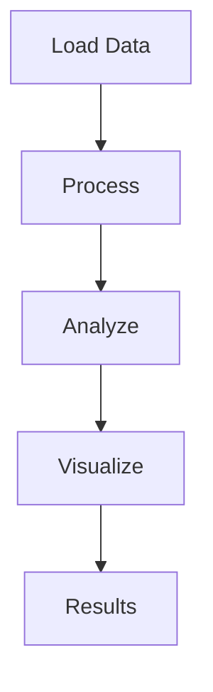

# Marker selection Example

## Overview

This example demonstrates marker selection analysis using open-source tools.

## Workflow



## Running the Example

```bash
cd examples/marker-selection
python run_*.py
```

## Output

Results saved to `output/` directory.

## QTLmax Equivalent

See QTLmax guide for marker selection procedure.
