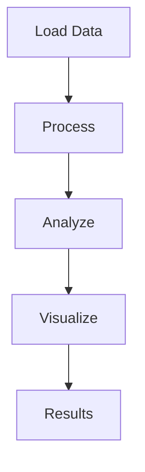

<!-- Copyright 2026 Clayton Young (borealBytes / Superior Byte Works, LLC) -->
<!-- Licensed under the Apache License, Version 2.0. -->

# Phenotype plots Example

## Overview

This example demonstrates phenotype plots analysis using open-source tools.

## Workflow



## Running the Example

```bash
cd examples/phenotype-plots
python run_*.py
```

## Output

Results saved to `output/` directory.

## QTLmax Equivalent

See QTLmax guide for phenotype plots procedure.
